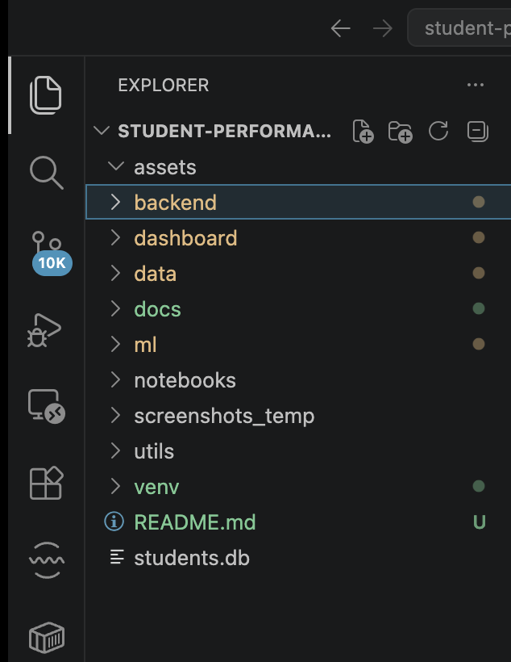
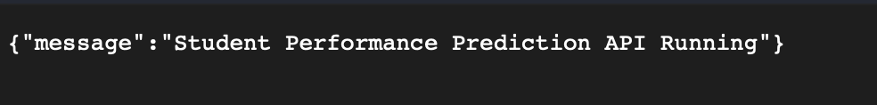
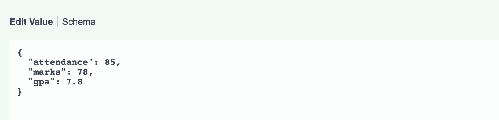
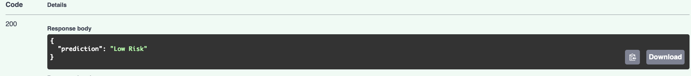

# Student Performance Prediction & Visualization System

An interactive academic analytics and student performance prediction system developed using FastAPI, Machine Learning, SQLite, and Python visualization libraries.

The system enables faculty and administrators to analyze academic performance across departments, semesters, subjects, attendance patterns, and GPA trends while identifying at-risk students using predictive analytics.

---

# Project Objectives

The primary objective of this project is to design and develop an interactive academic analytics platform that provides meaningful insights using data analysis and machine learning techniques.

The system is designed to:

- Analyze student academic performance across departments and semesters
- Identify at-risk students using predictive models
- Visualize academic trends through dashboards and charts
- Provide attendance and subject-wise performance analytics
- Support data-driven academic decision making

---

# Features

## Academic Analytics
- Student performance tracking
- Attendance analysis
- GPA monitoring
- Subject-wise marks analysis
- Department and semester filtering
- Performance trend visualization

## Machine Learning Prediction
- At-risk student prediction
- Academic risk classification
- Predictive insights using Random Forest Classifier
- Performance category prediction:
  - Low Risk
  - Medium Risk
  - High Risk

## Backend APIs
- RESTful APIs using FastAPI
- Swagger API documentation
- JSON request and response handling
- Modular backend architecture

## Database Integration
- SQLite relational database
- Structured academic data storage
- ORM support using SQLAlchemy

## Interactive Visualization
- Trend analysis dashboards
- GPA distribution charts
- Attendance vs performance correlation
- Subject-wise performance insights

---

# Tech Stack

| Technology | Purpose |
|---|---|
| Python | Core programming language |
| FastAPI | Backend API framework |
| SQLite | Database management |
| SQLAlchemy | ORM and database interaction |
| Pandas | Data preprocessing |
| Scikit-learn | Machine learning |
| Plotly | Interactive data visualization |

---

# System Architecture

```text
Frontend / Dashboard
        │
        ▼
FastAPI Backend APIs
        │
        ▼
SQLite Database
        │
        ▼
Machine Learning Model
        │
        ▼
Prediction & Analytics Engine
```

---

# Project Structure

```text
student-performance-system/
│
├── assets/
│   └── screenshots/
│
├── backend/
│   ├── main.py
│   ├── models.py
│   ├── schemas.py
│   ├── crud.py
│   ├── database.py
│   └── students.db
│
├── dashboard/
├── data/
│
├── docs/
│   ├── api.md
│   ├── architecture.md
│   └── user-guide.md
│
├── ml/
│   ├── train.py
│   ├── predict.py
│   └── model.pkl
│
├── notebooks/
├── utils/
│
├── README.md
└── requirements.txt
```

---

# Machine Learning Workflow

## Data Collection

Academic datasets containing:
- Attendance
- Marks
- GPA
- Student performance metrics

## Data Preprocessing

Performed using:
- Pandas
- NumPy

## Model Training

Algorithm used:
- Random Forest Classifier

## Prediction Labels

- Low Risk
- Medium Risk
- High Risk

---

# API Endpoints

## Home Endpoint

```http
GET /

```
### Response

```json
{
  "message": "Student Performance Prediction API Running"
}
```

---

## Prediction Endpoint

```http
POST /predict
```

### Request Body

```json
{
  "attendance": 85,
  "marks": 78,
  "gpa": 7.8
}
```

### Response

```json
{
  "prediction": "Low Risk"
}
```

---

# Installation & Setup

## Clone Repository

```bash
git clone https://github.com/baggashivansh/student-performance-system.git
```

## Navigate to Project

```bash
cd student-performance-system
```

## Create Virtual Environment

```bash
python3 -m venv venv
```

## Activate Virtual Environment

### macOS/Linux

```bash
source venv/bin/activate
```

### Windows

```bash
venv\Scripts\activate
```

## Install Dependencies

```bash
pip install -r requirements.txt
```

---

# Run FastAPI Server

```bash
uvicorn backend.main:app --reload
```

---

# Swagger API Documentation

Open in browser:

```text
http://127.0.0.1:8000/docs
```

---

# Screenshots

## Project Structure



## API Running



## Prediction Input



## Prediction Output



---

# Project Outcomes

The system successfully:

* Analyzes student academic data
* Predicts at-risk students
* Provides API-based analytics
* Integrates machine learning with backend systems
* Supports academic decision making using data insights

---

# Author

Shivansh Bagga
MCA JULY 2024-2026
UNIVERSITY ID : O24MCA112135 

---

# License

This project is developed for educational and academic purposes.

